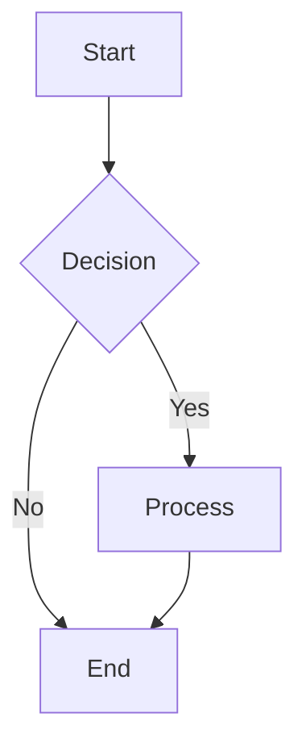

# Test Mermaid Diagram

This is a simple test to verify Mermaid rendering in VS Code.

## Instructions:
1. Open this file in VS Code
2. Press Ctrl+Shift+V to open Markdown Preview
3. You should see the flowchart rendered
