# Azure Core Infrastructure Module

This Terraform module creates the foundational Azure infrastructure including virtual networking, subnets, security groups, and monitoring components. It serves as the base layer for all other infrastructure modules in the Azure Policy project.

## Overview

The core infrastructure module provides:
- **Virtual Network (VNet)** with configurable address space
- **Multiple subnets** with dedicated purposes and security configurations
- **Network Security Groups (NSGs)** with baseline security rules
- **Network monitoring** with VNet flow logs and Network Watcher
- **Service endpoints** for secure Azure service connectivity
- **Subnet delegation** for Azure Functions integration

## Architecture

### Network Topology

```mermaid
flowchart TB
    subgraph Azure["🏢 Azure Subscription"]
        subgraph RG["📁 Resource Group: rg-azpolicy-dev-eastus"]
            subgraph VNet["🌐 VNet: vnet-azpolicy-dev-eastus-001"]
                subgraph AddressSpace["Address Space: 10.0.0.0/16"]

                    subgraph DefaultSub["Default Subnet"]
                        DS["snet-default-azpolicy-dev-eastus-001<br/>10.0.1.0/24"]
                        NSG1["nsg-azpolicy-default-dev-eastus-001"]
                        DS -.-> NSG1
                    end

                    subgraph FuncSub["Functions Subnet"]
                        FS["snet-functions-azpolicy-dev-eastus-001<br/>10.0.2.0/24"]
                        NSG2["nsg-azpolicy-functions-dev-eastus-001"]
                        DEL["🔗 Delegated to Microsoft.Web/serverFarms"]
                        SE["📡 Service Endpoints:<br/>• Microsoft.Storage<br/>• Microsoft.KeyVault"]
                        FS -.-> NSG2
                        FS --> DEL
                        FS --> SE
                    end

                    subgraph PESub["Private Endpoints Subnet"]
                        PES["snet-privateendpoints-azpolicy-dev-eastus-001<br/>10.0.4.0/24"]
                        NSG3["nsg-azpolicy-privateendpoints-dev-eastus-001"]
                        PES -.-> NSG3
                    end
                end
            end

            subgraph Monitor["🔍 Monitoring & Security"]
                NW["Network Watcher<br/>nw-azpolicy-dev-eastus-001"]
                SA["Storage Account<br/>stflowlogsazpolicydev001"]
                FL["VNet Flow Logs<br/>fl-vnet-azpolicy-dev"]

                NW --> FL
                FL --> SA
            end
        end
    end

    subgraph Rules["🛡️ Security Rules (All NSGs)"]
        SR1["✅ Allow HTTPS Inbound (443)"]
        SR2["❌ Deny HTTP Inbound (80)"]
        SR3["✅ Allow HTTPS Outbound (443)"]
        SR4["✅ Allow DNS Outbound (53)"]
        SR5["✅ Allow App Service Management (454-455)"]
    end

    %% NSG to Rules connections
    NSG1 -.-> SR1
    NSG1 -.-> SR2
    NSG1 -.-> SR3
    NSG1 -.-> SR4

    NSG2 -.-> SR1
    NSG2 -.-> SR2
    NSG2 -.-> SR3
    NSG2 -.-> SR4
    NSG2 -.-> SR5

    NSG3 -.-> SR1
    NSG3 -.-> SR2
    NSG3 -.-> SR3
    NSG3 -.-> SR4

    %% Styling
    classDef subnet fill:#f3e5f5,stroke:#9c27b0,stroke-width:2px
    classDef nsg fill:#fff3e0,stroke:#ff9800,stroke-width:2px
    classDef monitoring fill:#e8f5e8,stroke:#4caf50,stroke-width:2px
    classDef security fill:#ffebee,stroke:#f44336,stroke-width:2px

    class DS,FS,PES subnet
    class NSG1,NSG2,NSG3 nsg
    class NW,SA,FL monitoring
    class SR1,SR2,SR3,SR4,SR5 security
```



### Network Components

#### **Virtual Network**
- **Name**: `vnet-azpolicy-dev-eastus-001`
- **Address Space**: `10.0.0.0/16` (65,536 IP addresses)
- **Location**: East US
- **DNS**: Azure-provided DNS

#### **Subnets**

| Subnet | CIDR | Purpose | Special Features |
|--------|------|---------|------------------|
| **Default** | `10.0.1.0/24` | General workloads | Standard subnet for VMs, containers |
| **Functions** | `10.0.2.0/24` | Azure Functions | Delegated to `Microsoft.Web/serverFarms`<br/>Service endpoints: Storage, KeyVault |
| **Private Endpoints** | `10.0.4.0/24` | Private connectivity | For private endpoints to Azure services |

#### **Network Security Groups**
Each subnet has a dedicated NSG with baseline security rules:
- ✅ **Allow HTTPS Inbound** (Port 443) from Internet
- ❌ **Deny HTTP Inbound** (Port 80) from Internet
- ✅ **Allow HTTPS Outbound** (Port 443) to Internet
- ✅ **Allow DNS Outbound** (Port 53) to Internet
- ✅ **Allow App Service Management** (Ports 454-455) for Functions subnet

## Security Features

### **Network Segmentation**
- Isolated subnets for different workload types
- Dedicated NSGs per subnet with least-privilege access
- Service endpoints for secure Azure service connectivity

### **Monitoring & Compliance**
- **VNet Flow Logs**: Captures network traffic for security analysis
- **Network Watcher**: Provides network monitoring and diagnostic capabilities
- **Traffic Analytics**: Optional integration with Log Analytics workspace

### **Future-Proof Design**
- Uses VNet flow logs (replaces deprecated NSG flow logs)
- Prepared for NSG flow log retirement (September 2027)
- BGP route propagation enabled for advanced routing scenarios

## Usage

### **Prerequisites**
- Azure subscription with appropriate permissions
- Terraform >= 1.5
- Azure CLI authenticated

### **Basic Deployment**

```bash
# From the project root directory:

# Initialize Core infrastructure workspace
make terraform-core-init

# Plan Core infrastructure changes
make terraform-core-plan

# Apply Core infrastructure changes
make terraform-core-apply

# Destroy Core infrastructure (use with caution)
make terraform-core-destroy
```

### **Alternative: Module-Specific Commands**

If you prefer to work directly in the core module directory:

```bash
# Change to the core module directory
cd infrastructure/core

# Check available commands
make help

# Check Terraform Cloud authentication
make login

# Initialize Terraform workspace
make init

# Validate configuration
make validate

# Format Terraform files
make fmt

# Plan the deployment
make plan

# Apply the configuration
make apply

# View outputs
make output

# Destroy infrastructure (use with caution)
make destroy

# Clean local Terraform files
make clean
```

### **Custom Configuration**

```hcl
module "core_infrastructure" {
  source = "./infrastructure/core"

  subscription_id = "your-subscription-id"
  environment     = "prod"
  location        = "East US 2"

  # Custom VNet address space
  vnet_address_space = ["10.1.0.0/16"]

  # Custom subnet configuration
  subnet_config = {
    web = {
      address_prefixes  = ["10.1.1.0/24"]
      service_endpoints = ["Microsoft.Storage"]
    }
    data = {
      address_prefixes  = ["10.1.2.0/24"]
      service_endpoints = ["Microsoft.Sql", "Microsoft.Storage"]
    }
  }

  # Enable advanced features
  enable_network_watcher = true
  enable_flow_logs      = true
}
```

### **Integration with Other Modules**

This core module outputs essential networking information for other modules:

```hcl
# Use in App Service module
module "app_service" {
  source = "../app-service"

  resource_group_name = module.core.resource_group_name
  subnet_id          = module.core.subnet_ids["functions"]
  vnet_id            = module.core.vnet_id
}
```

## Troubleshooting

### **Common Issues**

**Issue**: Subnet delegation conflicts
```bash
Error: subnet is already delegated to service Microsoft.Web/serverFarms
```
**Solution**: Remove existing delegation or use a different subnet name.

**Issue**: NSG rule conflicts
```bash
Error: security rule priority 100 already exists
```
**Solution**: Adjust rule priorities in the networking module variables.

**Issue**: Flow logs storage account naming
```bash
Error: storage account name must be globally unique
```
**Solution**: The module automatically generates unique names using random suffixes.

### **Validation Commands**

```bash
# Verify VNet configuration
az network vnet show --name vnet-azpolicy-dev-eastus-001 --resource-group rg-azpolicy-dev-eastus

# Check subnet delegations
az network vnet subnet show --vnet-name vnet-azpolicy-dev-eastus-001 --name snet-functions-azpolicy-dev-eastus-001 --resource-group rg-azpolicy-dev-eastus

# Verify NSG rules
az network nsg rule list --nsg-name nsg-azpolicy-functions-dev-eastus-001 --resource-group rg-azpolicy-dev-eastus
```

<!-- BEGIN_TF_DOCS -->
## Requirements

| Name | Version |
|------|---------|
| <a name="requirement_terraform"></a> [terraform](#requirement\_terraform) | >= 1.5 |
| <a name="requirement_azurerm"></a> [azurerm](#requirement\_azurerm) | ~> 4.37 |
| <a name="requirement_random"></a> [random](#requirement\_random) | ~> 3.4 |

## Providers

| Name | Version |
|------|---------|
| <a name="provider_azurerm"></a> [azurerm](#provider\_azurerm) | 4.39.0 |
| <a name="provider_random"></a> [random](#provider\_random) | 3.7.2 |

## Modules

| Name | Source | Version |
|------|--------|---------|
| <a name="module_networking"></a> [networking](#module\_networking) | github.com/stuartshay/azure-policy//infrastructure/terraform/modules/networking | v0.1.0 |

## Resources

| Name | Type |
|------|------|
| [azurerm_resource_group.main](https://registry.terraform.io/providers/hashicorp/azurerm/latest/docs/resources/resource_group) | resource |
| [random_string.suffix](https://registry.terraform.io/providers/hashicorp/random/latest/docs/resources/string) | resource |

## Inputs

| Name | Description | Type | Default | Required |
|------|-------------|------|---------|:--------:|
| <a name="input_cost_center"></a> [cost\_center](#input\_cost\_center) | Cost center for resource billing | `string` | `"development"` | no |
| <a name="input_enable_flow_logs"></a> [enable\_flow\_logs](#input\_enable\_flow\_logs) | Enable Network Security Group flow logs | `bool` | `true` | no |
| <a name="input_enable_network_watcher"></a> [enable\_network\_watcher](#input\_enable\_network\_watcher) | Enable Network Watcher for network monitoring | `bool` | `true` | no |
| <a name="input_environment"></a> [environment](#input\_environment) | Environment name (dev, staging, prod) | `string` | `"dev"` | no |
| <a name="input_location"></a> [location](#input\_location) | Azure region for resources | `string` | `"East US"` | no |
| <a name="input_owner"></a> [owner](#input\_owner) | Owner of the resources (team name or email) | `string` | `"platform-team"` | no |
| <a name="input_subnet_config"></a> [subnet\_config](#input\_subnet\_config) | Configuration for core subnets only | <pre>map(object({<br/>    address_prefixes  = list(string)<br/>    service_endpoints = optional(list(string), [])<br/>    delegation = optional(object({<br/>      name = string<br/>      service_delegation = object({<br/>        name    = string<br/>        actions = optional(list(string), [])<br/>      })<br/>    }), null)<br/>  }))</pre> | <pre>{<br/>  "default": {<br/>    "address_prefixes": [<br/>      "10.0.1.0/24"<br/>    ],<br/>    "service_endpoints": []<br/>  },<br/>  "functions": {<br/>    "address_prefixes": [<br/>      "10.0.2.0/24"<br/>    ],<br/>    "delegation": {<br/>      "name": "Microsoft.Web.serverFarms",<br/>      "service_delegation": {<br/>        "actions": [<br/>          "Microsoft.Network/virtualNetworks/subnets/action"<br/>        ],<br/>        "name": "Microsoft.Web/serverFarms"<br/>      }<br/>    },<br/>    "service_endpoints": [<br/>      "Microsoft.Storage",<br/>      "Microsoft.KeyVault"<br/>    ]<br/>  },<br/>  "privateendpoints": {<br/>    "address_prefixes": [<br/>      "10.0.4.0/24"<br/>    ],<br/>    "service_endpoints": []<br/>  }<br/>}</pre> | no |
| <a name="input_subscription_id"></a> [subscription\_id](#input\_subscription\_id) | Azure subscription ID | `string` | n/a | yes |
| <a name="input_vnet_address_space"></a> [vnet\_address\_space](#input\_vnet\_address\_space) | Address space for the virtual network | `list(string)` | <pre>[<br/>  "10.0.0.0/16"<br/>]</pre> | no |
| <a name="input_workload"></a> [workload](#input\_workload) | Name of the workload or application | `string` | `"azpolicy"` | no |

## Outputs

| Name | Description |
|------|-------------|
| <a name="output_common_tags"></a> [common\_tags](#output\_common\_tags) | Common tags applied to all resources |
| <a name="output_environment"></a> [environment](#output\_environment) | Environment name |
| <a name="output_location"></a> [location](#output\_location) | Azure location |
| <a name="output_nsg_ids"></a> [nsg\_ids](#output\_nsg\_ids) | Map of NSG names to their IDs |
| <a name="output_resource_group_id"></a> [resource\_group\_id](#output\_resource\_group\_id) | ID of the resource group |
| <a name="output_resource_group_location"></a> [resource\_group\_location](#output\_resource\_group\_location) | Location of the resource group |
| <a name="output_resource_group_name"></a> [resource\_group\_name](#output\_resource\_group\_name) | Name of the resource group |
| <a name="output_storage_account_id"></a> [storage\_account\_id](#output\_storage\_account\_id) | ID of the storage account for logs |
| <a name="output_storage_account_name"></a> [storage\_account\_name](#output\_storage\_account\_name) | Name of the storage account for logs |
| <a name="output_storage_account_primary_blob_endpoint"></a> [storage\_account\_primary\_blob\_endpoint](#output\_storage\_account\_primary\_blob\_endpoint) | Primary blob endpoint of the storage account |
| <a name="output_subnet_ids"></a> [subnet\_ids](#output\_subnet\_ids) | Map of subnet names to their IDs |
| <a name="output_vnet_id"></a> [vnet\_id](#output\_vnet\_id) | ID of the virtual network |
| <a name="output_vnet_name"></a> [vnet\_name](#output\_vnet\_name) | Name of the virtual network |
<!-- END_TF_DOCS -->
